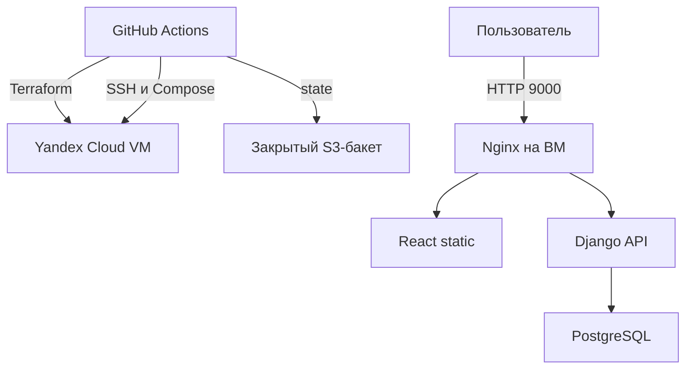

# Kittygram: виртуальная инфраструктура и CI/CD

Учебный проект Яндекс Практикума. Автор: [Mezhnun89](https://github.com/Mezhnun89).
Репозиторий продолжает Kittygram из дисциплины CI/CD и добавляет инфраструктуру Yandex Cloud.

**Статус:** код подготовлен; создание новой облачной ВМ и проверку на ней ещё необходимо выполнить.
Адрес в `tests.yml` до первого `Terraform infrastructure → apply` относится к предыдущему развёртыванию.
Успешный старый workflow не подтверждает готовность этой инфраструктуры.

## Что разворачивается

- Отдельные VPC, подсеть `10.42.0.0/24`, Security Group, статический публичный IPv4.
- Ubuntu 24.04 LTS: 2 vCPU, 2 ГБ RAM, 20 ГБ SSD. Образы приложения собираются на GitHub runner.
- Входящие TCP: **22** для SSH и **9000** для gateway. Исходящий трафик разрешён полностью.
- `cloud-init` создаёт пользователя `deploy`, настраивает SSH по ключу, устанавливает Docker Engine и Compose plugin.
- PostgreSQL, Django/Gunicorn, сборка React и Nginx запускаются через Compose. Порт PostgreSQL наружу не опубликован.
- Закрытый S3-бакет с версиями хранит `kittygram/production.tfstate`. Бакет создаётся заранее отдельным `bootstrap/`.



## Начать здесь

Подробная последовательность: [docs/SETUP.md](docs/SETUP.md).
Конспект для подготовки к сдаче: [docs/KONSPEKT.md](docs/KONSPEKT.md).
Проверки и оставшиеся шаги: [docs/VERIFICATION.md](docs/VERIFICATION.md).

1. Получить у куратора промокод и подготовить отдельный учебный каталог Yandex Cloud.
2. Настроить сервисный аккаунт, создать S3-бакет из `bootstrap/`, добавить GitHub Secrets/Variables.
3. Объединить ветку с `main` после успешных проверок PR.
4. Actions → **Terraform infrastructure** → Run workflow → `plan`, изучить список ресурсов; затем `apply`.
5. Проверить ключ SSH-сервера в консоли YC и добавить `SSH_KNOWN_HOSTS`.
6. Установить переменную `DEPLOY_ENABLED=true`, вручную запустить **Kittygram deployment**.
7. Проверить функциональность сайта, сохранить результаты, отправить публичную ссылку на репозиторий в Практикум.

## Workflow

| Файл | Назначение |
| --- | --- |
| `.github/workflows/ci.yml` | PR-проверки: PEP8, backend с PostgreSQL, frontend, файлы задания, Terraform validate, Compose |
| `.github/workflows/terraform.yml` | Ручные `plan`, `apply`, `destroy`; после apply записывает фактический URL в `tests.yml` |
| `.github/workflows/deploy.yml` | Проверки, сборка трёх образов, DockerHub, деплой на IP из state, smoke/autotests, Telegram |
| `kittygram_workflow.yml` | Точная копия deploy workflow для проверок Практикума |

Публикация и деплой включаются переменной `DEPLOY_ENABLED=true` после подготовки облака.
После этого push в `main` запускает CI/CD; изменения только README, docs и tests.yml деплой не вызывают.
Образы публикуются с тегом SHA коммита и `latest`; сервер получает конкретный SHA.
Terraform и deployment используют одну GitHub concurrency group и не выполняются одновременно.
State не публикуется в Git или Actions artifacts. Планы хранятся только во временной рабочей папке runner.

## Повторный деплой

`remote-deploy.sh` дожидается готовности БД, выполняет миграции, копирует новую сборку React,
собирает Django static в общий volume и пересоздаёт backend/gateway. Volumes БД и media сохраняются.
Новый image Ubuntu из семейства не вызывает автоматическую замену существующей ВМ.
Смена ОС или конфигурации, требующая замены ВМ, выполняется отдельно с предварительным backup.

## Проверки локально

С Python 3.10, Node 22 и запущенным PostgreSQL с параметрами из окружения:

```bash
pip install -r backend/requirements.txt flake8 requests
flake8 backend --max-line-length=100 --exclude=backend/*/migrations --extend-ignore=E501
python backend/manage.py test cats --verbosity 2
pytest tests/test_files.py
cd frontend
npm ci
CI=true npm test -- --watchAll=false --runInBand
```

После деплоя: `python scripts/smoke_test.py http://<VM_IP>:9000` и `pytest tests/`.
Backend-тесты проверяют доступ гостей, защиту чужих карточек, создание/изменение/удаление и пагинацию.
Полную ручную проверку регистрации, входа, фото и достижений см. в чек-листе.

## Завершение практики

После зачёта и сохранения нужных данных отключить `DEPLOY_ENABLED`, запустить Terraform `destroy`.
Эта операция удаляет ВМ **вместе с БД и фотографиями на диске**, а также сеть и публичный IP.
S3-бакет и bootstrap-state сохраняются отдельно: их не удаляет основной workflow.
Для восстановления БД нужны `pg_dump` и копия media; Terraform state содержит инфраструктуру, а не пользовательские данные.
